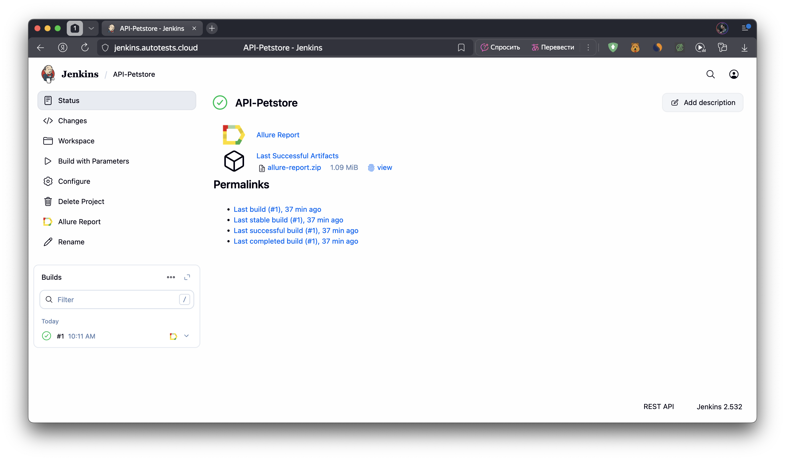
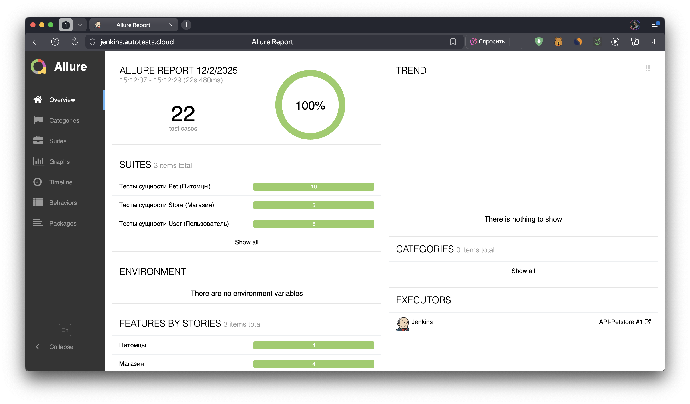
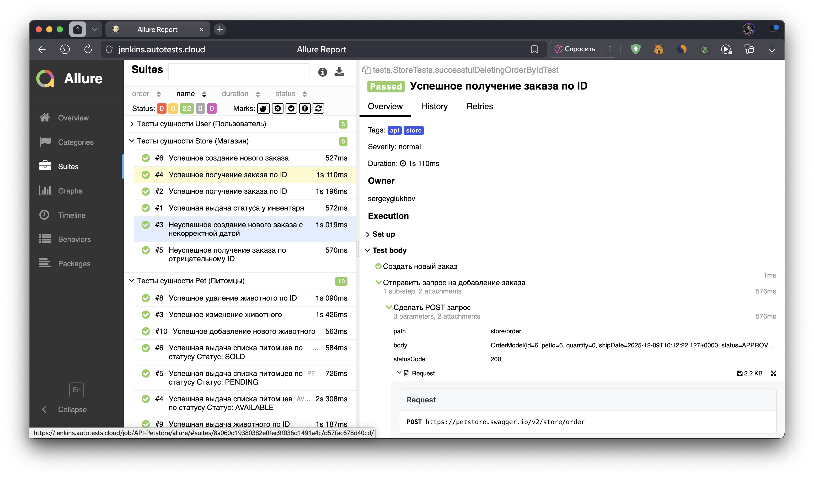
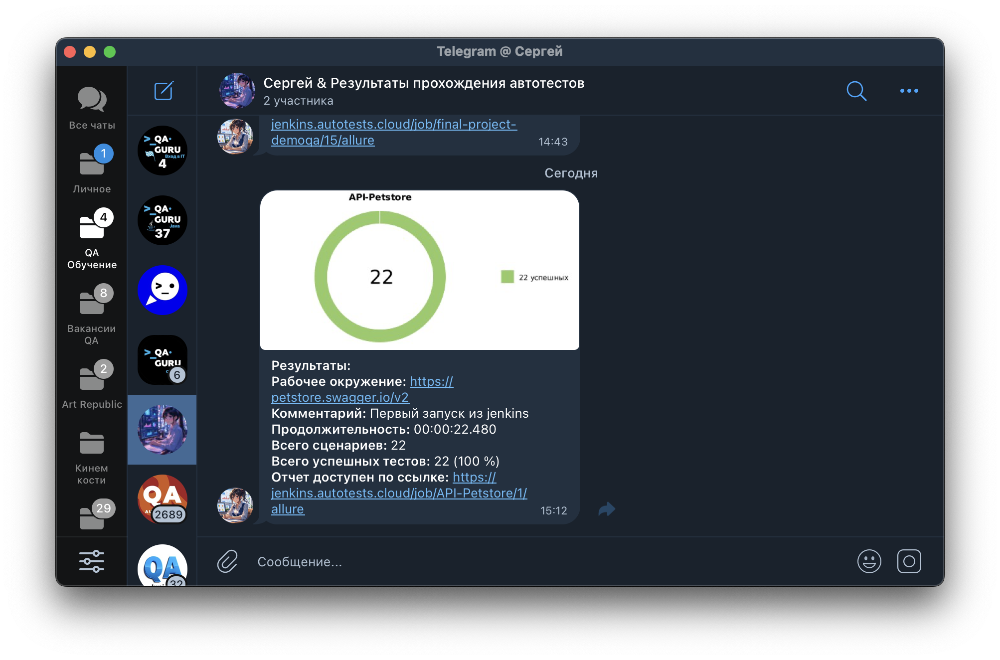

# Тестовое задание. Проект API автотестесты для Petstore

Проект автоматизированного тестирования REST API сервиса **Petstore** с использованием **Java**, **RestAssured**, **JUnit 5** и **Allure Reports**.

## Содержание

- [Описание проекта](#-описание-проекта)
- [Технический стек](#-технический-стек)
- [Структура проекта](#-структура-проекта)
- [Проведенные автотесты](#-проведенные-автотесты)
- [Сборка в Jenkins](#-сборка-в-jenkins)
- [Запуск тестов](#-запуск-тестов)
- [Allure отчет](#-allure-отчет)
- [Отчет в Telegram](#-отчет-в-telegram)


## 📋 Описание проекта

Этот проект демонстрирует полноценную структуру автотестов для REST API с поддержкой:

- ✅ **GET, POST, PUT, DELETE** запросы
- ✅ Параметризованные тесты (@ParameterizedTest)
- ✅ Негативные тесты (проверка ошибок и граничных случаев)
- ✅ Работа с моделями данных (POJO) через Jackson
- ✅ Page Object Pattern для REST helper методов
- ✅ Подробные отчёты Allure с кастомными шаблонами
- ✅ CI/CD интеграция (Jenkins + Telegram уведомления)
- ✅ Генерация тестовых данных (Faker)

## 🛠️ Технический стек

| Компонент                  | Версия | Назначение                             |
|----------------------------|--------|----------------------------------------|
| Java                       | 17     | Язык программирования                  |
| Gradle                     | 8.13   | Сборка проекта                         |
| JUnit 5                    | 5.10.0 | Фреймворк модульного тестирования      |
| RestAssured                | 5.5.2  | Тестирование REST API                  |
| RestAssured JSON Validator | 5.5.2  | Валидация JSON-схем                    |
| AssertJ                    | 3.22.0 | Fluent assertions                      |
| SLF4J                      | 2.0.7  | Логирование                            |
| Allure Gradle Plugin       | 2.11.2 | Интеграция Allure с Gradle             |
| Allure                     | 2.21.0 | Отчётность по автотестам               |
| Allure RestAssured         | 2.21.0 | Логирование HTTP в Allure              |
| Lombok (freefair plugin)   | 8.6    | Генерация кода (геттеры/сеттеры и т.п.)|
| JavaFaker                  | 1.0.2  | Генерация тестовых данных              |

## 📁 Структура проекта

```
src/test/
├── java/
│   ├── data/                           # Тестовые данные и енумы
│   │   ├── OrderStatus.java            # Enum статусов заказа
│   │   ├── PetStatus.java              # Enum статусов питомца
│   │   └── TestData.java               # Класс для тестовых данных
│   │
│   ├── helpers/                        # Вспомогательные классы
│   │   ├── ApiTestHelpers.java         # REST методы (GET, POST, PUT, DELETE)
│   │   └── CustomAllureListener.java   # Кастомные шаблоны Allure
│   │
│   ├── models/                         # POJO модели для сериализации
│   │   ├── PetModel.java
│   │   ├── OrderModel.java
│   │   ├── UserModel.java
│   │   ├── Category.java
│   │   ├── Tag.java
│   │   └── ApiResponseModel.java
│   │
│   ├── specs/                          # BaseSpecs конфигурация
│   │   └── BaseSpecs.java              # RequestSpec и ResponseSpec
│   │
│   ├── tests/                          # Тесты
│   │   ├── PetTests.java               # Тесты для Pet (питомцы)
│   │   ├── StoreTests.java             # Тесты для Store (заказы)
│   │   ├── UserTests.java              # Тесты для User (пользователи)
│   │   └── TestBase.java               # Базовый класс с инициализацией
│   │
│   └── utils/                          # Утилиты
│       └── RandomUtils.java            # Генерация случайных данных (Faker)
│
└── resources/
    └── tpl/                            # Кастомные FreeMarker шаблоны для Allure
        ├── request.ftl                 # Шаблон HTTP Request в отчёте
        └── response.ftl                # Шаблон HTTP Response в отчёте
```

## ✌️ Проведенные автотесты

- **Тесты сущности Pet (Питомцы)**
  - Успешная выдача списка питомцев по всем валидным статусам (параметризованный тест)
  - Успешное получение питомца по ID (создание + получение по ID)
  - Неуспешное получение питомца по случайному несуществующему ID 
  - Запрос списка питомцев с невалидным статусом, возвращающий пустой список (задокументированный баг API)
  - Успешное добавление нового животного 
  - Успешное изменение данных животного 
  - Успешное удаление животного по корректному ID 
  - Неуспешное удаление животного с некорректным текстовым ID


- **Тесты сущности Store (Магазин / заказы)**
  - Успешная выдача статусов инвентаря, проверка наличия основных статусов и положительных значений 
  - Успешное создание нового заказа 
  - Неуспешное создание заказа с некорректным форматом даты 
  - Успешное получение заказа по ID 
  - Неуспешное получение заказа по отрицательному ID 
  - Успешное удаление заказа по ID


- **Тесты сущности User (Пользователь)**
  - Успешное создание одного пользователя 
  - Успешное создание списка пользователей (параметризованный тест для createWithList и createWithArray)
  - Успешное получение пользователя по username 
  - Успешное обновление данных пользователя по username 
  - Успешное удаление пользователя по username

## 📋 Сборка в Jenkins
[**Сборка в Jenkins**](https://jenkins.autotests.cloud/job/API-Petstore/)
<p>

</p>

### Параметры сборки в Jenkins:
Сборка в Jenkins

- task (выбор групп тестов в разбивке по тестируемым сущностям)
- baseUri (базовый URI, по умолчанию: https://petstore.swagger.io/v2 )

## 🚀 Запуск тестов
Локальный запуск:
`
gradle clean test
`

Удаленный запуск:
```
clean 
${TASK}_test 
-DbaseUri=${BASE_URI}
```

## 📑 Allure отчет

[Allure отчет из Jenkins](https://jenkins.autotests.cloud/job/API-Petstore/allure/)

- ### Главный экран отчета
<p>

</p>

- ### Страница с проведенными тестами
<p>

</p>

## 💬 Отчет в Telegram
<p>

</p>